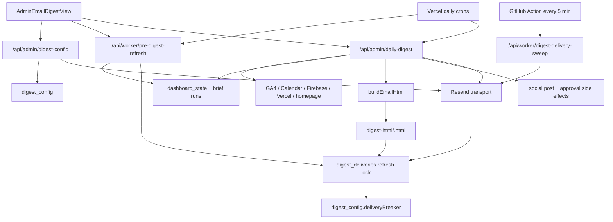

# Email System Simplification — Fable Handoff

**Status:** review and redesign brief; implementation has not started  
**Verified against:** production commit `fbb6bc60` on 2026-08-17  
**Primary objective:** make the automated email system smaller, more explicit, cheaper to reason about, and more dependable without losing the delivery guarantees added after the August incident  
**Canonical behavior reference:** [`../source-of-truth/EMAIL-DIGEST-CARD.md`](../source-of-truth/EMAIL-DIGEST-CARD.md)  
**Important:** the canonical document contains historical checkpoints and several stale statements. The contradictions identified in this handoff were verified directly against the current code and must be resolved during the redesign.

---

## 0. Fable mission

Redesign the email subsystem so a future engineer can answer these questions by reading a small number of explicit files:

1. Which clients receive an email?
2. At what actual time will each client receive it?
3. What paid work runs before the email?
4. Which saved data and live collectors feed the email?
5. What exact HTML was sent?
6. What happens when Resend, Firestore, a collector, or an LLM fails?
7. How is a duplicate send prevented?
8. How can an operator see, retry, pause, or repair a failed delivery?

The redesign is not permission to delete hard-won reliability behavior. It is permission to remove accidental complexity, collapse redundant layers, clarify ownership, and replace misleading UI/contracts.

Do not begin with a big-bang rewrite. First produce an evidence-backed architecture proposal and a migration sequence. Preserve production behavior with characterization tests, then migrate one boundary at a time.

---

## 1. Executive summary

The current email system works through a collection of routes and CommonJS helpers that accumulated around a single 3,540-line route. It now supports:

- per-client enrollment and recipients;
- 33 individually configurable content sections;
- saved section order;
- live and template previews;
- manual Generate & Send;
- scheduled multi-client refresh and send fan-out;
- Scout, analysis, video-caption, summary, and Executive Brief generation;
- calendar, weather, GA4, homepage, Firebase, Vercel, Market Signals, video, and social data;
- durable HTML snapshots;
- Resend idempotency keys;
- retries with backoff;
- transactional send leases;
- abandoned-send recovery;
- a per-client delivery circuit breaker;
- a global paid-refresh kill switch;
- social-post queueing and approval links;
- a separate approval-rollup email.

Those capabilities are spread across UI, config normalization, refresh orchestration, rendering, social publishing, transport, delivery state, and cron fan-out. Several concepts have multiple sources of truth, and some user-facing controls do not affect runtime behavior.

The most important current facts are:

- `schedule.enabled` and `frequency !== 'off'` are the only schedule fields used for enrollment.
- `sendHour`, `weekday`, and the distinction between `daily` and `weekly` are not honored by the scheduler.
- Production sends at fixed UTC cron times from `vercel.json`.
- The UI’s `CST` label is display-only and is not daylight-saving-aware.
- Live preview is not reliably free: it can call the summary and video-caption LLMs unless `noLlm=1` is passed, and the current UI does not pass it.
- Manual Generate & Send explicitly refreshes signals and analysis before sending, including paid X search.
- The send route can enqueue or publish social content before email delivery is confirmed.
- The main digest uses durable delivery; the approval-rollup mode still uses a separate, non-idempotent `sendEmail()` function.
- The retry GitHub Action is now committed and active on the default branch, despite stale comments saying it is uncommitted.
- Code and tests are green, but a post-deploy automatic inbox delivery has not yet been independently certified.

---

## 2. Non-negotiable invariants

Fable may simplify implementation, but the replacement must preserve or improve these guarantees.

### 2.1 Delivery guarantees

- A scheduled occurrence has one deterministic identity per client and local schedule occurrence.
- A manual click has a stable request id generated once per user action.
- Replaying the same manual request id cannot create a second delivery.
- Two genuinely different manual clicks must not collapse into one delivery.
- Rendered HTML, subject, and recipient become immutable before the first provider call.
- Every provider attempt uses the same deterministic Resend `Idempotency-Key` for that immutable payload.
- Only one worker can own a send attempt at a time.
- A killed worker cannot leave a delivery permanently stuck in `sending`.
- A stale worker cannot write an outcome after another worker reclaimed the lease.
- Retry scheduling is bounded and stops before the provider’s idempotency window becomes unsafe.
- A confirmed `sent` delivery can never regress.
- Terminal delivery state and circuit-breaker bookkeeping commit atomically.
- Provider response logging must never persist email content, API keys, or raw sensitive response bodies.

### 2.2 Spend guarantees

- No paid refresh runs if `RESEND_API_KEY` is missing.
- No paid refresh runs when the global kill switch is active.
- No paid refresh runs for a client whose delivery breaker is paused.
- No paid refresh runs while another unresolved delivery for that client is still live or retrying, unless an explicit operator override is designed and authorized.
- Refresh concurrency is claimed atomically so duplicate requests cannot run the same paid work in parallel.
- Preview must be free by default in the redesigned system.
- Paid X search must remain explicit, attributable, and off for unattended runs unless the client opted in.

### 2.3 Content guarantees

- Preview and send must use the same renderer.
- A section that is enabled must either render its content or render an explicit empty/error state; it must never silently disappear because data is absent.
- Existing saved `digest_config` documents must continue to normalize correctly through migration.
- Existing section order and include settings must not be silently reset.
- A failed optional collector must not erase last-good saved intelligence.
- A renderer or collector failure must be visible in durable state and operator UI.

### 2.4 Security guarantees

- Dashboard preview, config, manual send, retry, and breaker reset remain admin-authenticated.
- Worker routes remain secret-authenticated and fail closed in production.
- Side effects must use `POST`; a new design must not preserve `GET ?send=1` as the public contract.
- Cross-client reads, recipients, videos, social accounts, and Client Brain context must remain scoped to the explicitly selected client.

---

## 3. Current user-facing workflows

### 3.1 Configure a client

Surface: `components/AdminEmailModals.jsx` → `AdminEmailDigestView`.

The admin can set:

- daily email on/off;
- cadence (`daily` or `weekly`);
- recipient;
- send hour;
- weekday;
- timezone;
- included sections;
- section order;
- summary settings;
- Executive Brief link mode;
- demo-data groups;
- suggested-post platforms;
- daily video source and publishing owner;
- social auto-publish settings;
- paid daily X search opt-in;
- contact URL;
- source clients and document limits.

Saving calls `POST /api/admin/digest-config` and writes `digest_config/{clientId}`.

### 3.2 Preview

The UI defaults to live preview and calls:

```text
GET /api/admin/daily-digest?preview=1&clientId=...
```

It may also pass unsaved include, order, post-platform, demo, and contact URL overrides in query parameters.

Template preview calls `preview=template` and uses fixtures.

Important current behavior:

- Template preview is free.
- Live preview is read-only with respect to email delivery and social publishing.
- Live preview is not necessarily free: summary and video-caption LLM calls run unless `noLlm=1` is present.
- `AdminEmailDigestView` does not currently add `noLlm=1`.

### 3.3 Manual Generate & Send

The UI:

1. creates `freshnessToken`;
2. creates one `requestId` for the click;
3. saves the current config;
4. calls refresh `phase=signals` with `force=1&allowX=1`;
5. calls refresh `phase=analysis`;
6. calls `GET /api/admin/daily-digest?send=1&skipRefresh=1&requestId=...`;
7. shows returned log lines in the shared dashboard terminal.

The refresh failures are caught in the UI, logged into the terminal, and do not block the send. The email then uses last-good saved data where necessary.

Manual Generate & Send intentionally does not run the `modules` phase, so it does not start a new video render. It selects the latest completed video.

### 3.4 Scheduled run

Vercel currently triggers:

```text
12:35 UTC  /api/worker/pre-digest-refresh
13:00 UTC  /api/admin/daily-digest
```

The refresh route without `clientId`:

1. scans up to 500 `digest_config` documents;
2. selects enrolled clients;
3. sorts least-recently-refreshed first;
4. re-enters itself with one request per client;
5. runs clients in waves of 3;
6. stamps each config with refresh outcome.

The send route without `clientId`:

1. performs a retry sweep;
2. scans and sorts enrolled clients least-recently-sent first;
3. re-enters itself once per client;
4. runs clients in waves of 4;
5. stamps each config with send outcome.

### 3.5 Retry

Due work is retried by:

- the daily send fan-out;
- the authenticated digest-delivery sweep route;
- `.github/workflows/digest-delivery-sweep.yml` every 5 minutes;
- a best-effort opportunistic sweep when an admin opens the Email Digest card;
- explicit admin retry through `POST /api/admin/digest-config` with `action:'retry-delivery'`.

All of these routes reuse stored HTML and the original idempotency key. They do not rerun Scout, analysis, rendering, or captions.

---

## 4. Actual schedule behavior — critical mismatch

The current schedule UI overpromises.

Stored config:

```js
schedule: {
  enabled: false,
  frequency: 'off',       // daily | weekly | off
  sendHour: 7,            // 0–23
  weekday: 1,             // 0–6
  timezone: 'America/Chicago'
}
```

Runtime enrollment is only:

```js
schedule.enabled === true && schedule.frequency !== 'off'
```

Consequences:

- `sendHour` is stored but ignored.
- `weekday` is stored but ignored.
- `weekly` is treated the same as `daily`; an enrolled weekly client is eligible every day.
- `timezone` affects delivery date identity, but not the trigger time.
- Production refresh and send use fixed UTC times from `vercel.json`.
- `13:00 UTC` is 8:00 AM during US Central daylight time and 7:00 AM during standard time.
- The new UI displays `2:00 PM CST`-style labels but only saves the numeric hour; it does not move the cron.
- The UI deliberately displays `CST` for `America/Chicago`, even during daylight time when the accurate abbreviation is `CDT`.

This must be the first product decision in the redesign:

### Option A — honest global schedule

Remove per-client hour/weekday controls and show the one actual system schedule. Lowest code and operational complexity.

### Option B — real per-client schedule

Persist a computed `nextRunAt`, run a dependable dispatcher frequently, atomically claim due clients, and compute the next occurrence using the client’s IANA timezone and cadence. This needs a scheduler more dependable and precise than a user-facing fiction. If GitHub Actions remains the dispatcher, document its timing-delay limitations. For stronger guarantees, use a managed scheduler/queue with an explicit production rollout gate.

Do not retain the current halfway state.

---

## 5. Current architecture and ownership



### 5.1 Primary files

| Concern | Current file | Notes |
|---|---|---|
| Card UI | `components/AdminEmailModals.jsx` | Settings, preview, refresh phases, send, request id, terminal UX |
| Config schema | `features/intelligence/_digest-config.js` | Defaults, normalization, enrollment scan, cron stamps, client resolution |
| Config/operator API | `app/api/admin/digest-config/route.js` | Read/save, delivery status, retry, breaker reset, opportunistic sweep |
| Refresh orchestration | `app/api/worker/pre-digest-refresh/route.js` | Dispatcher and worker modes; Scout, watchlist, platform searches, recipes, summaries |
| Main route | `app/api/admin/daily-digest/route.js` | Auth modes, fan-out, collectors, renderer, LLM summaries/captions, social side effects, durable send, approval rollup |
| Durable state | `api/_lib/digest-delivery.cjs` | Identity, state machine, immutable HTML, locks, leases, retries, retention helpers |
| Transport | `api/_lib/resend-transport.cjs` | Resend request and response classification |
| Spend preflight | `api/_lib/digest-refresh-preflight.cjs` | Kill switch, transport, breaker, unresolved-delivery guard |
| Circuit breaker | `api/_lib/digest-circuit-breaker.cjs` | Three terminal failures pause future paid refreshes |
| Retry route | `app/api/worker/digest-delivery-sweep/route.js` | Transport-only sweep |
| Retry scheduler | `.github/workflows/digest-delivery-sweep.yml` | Five-minute wake-up |
| Cron config | `vercel.json` | Fixed daily refresh/send times |
| Canonical behavior doc | `docs/source-of-truth/EMAIL-DIGEST-CARD.md` | Extensive history; not internally consistent at every checkpoint |

### 5.2 Other coupled files

- `features/intelligence/_brief-summary.js`
- `features/intelligence/_brief-intel.js`
- `features/intelligence/_digest-brief-link.js`
- `features/client-brain/store.cjs`
- `features/strategy-builder/generate-plan.js`
- `features/intelligence/analysis-recipes/*`
- `features/social-posting/*`
- `api/_lib/social-approval.cjs`
- `DashboardPage.jsx`
- `app/post-approval/page.jsx`
- `app/api/dashboard/web-stats/config/route.js`
- `docs/source-of-truth/SOCIAL-AUTO-PUBLISH.md`
- `docs/source-of-truth/X-API-AND-PROFILE-OPERATIONS.md`
- `docs/source-of-truth/OPERATING-COST-CARD.md`
- `docs/source-of-truth/VERCEL-HOBBY-DEPLOYMENT.md`

---

## 6. Config contract

Collection: `digest_config/{clientId}`.

Normalized fields:

| Field | Purpose |
|---|---|
| `summaryEnabled` | Whether summary LLM may run |
| `tone` | Summary tone instruction |
| `recentDocsCount` | Knowledge documents read for summary |
| `maxDocChars` | Knowledge text cap |
| `extraInstructions` | Additional prompt instructions |
| `homeClientId` | Primary intelligence/brain source |
| `includeClientIds` | Additional client briefs folded into email |
| `include` | One boolean per rendered email section |
| `demoMetrics` | Replace internal metric groups with demo fixtures |
| `order` | Saved section order |
| `postPlatforms` | Platforms allowed in Suggested Posts section |
| `autoPublish` | Per-platform off/auto/approval policy |
| `dailyVideo` | Publishing owner, asset owner, source folders |
| `schedule` | Enrollment plus currently-unhonored cadence fields |
| `briefLinkMode` | `fresh`, `latest`, or `off` |
| `contactUrl` | Contact CTA |
| `autoPostX` | Queue suggested X post during real send; defaults true |
| `dailyXSearch` | Allow paid X search during unattended refresh |
| `recipientEmail` | Recipient; blank falls back to admin `DIGEST_EMAIL` |
| `deliveryBreaker` | Operational breaker state, mixed into config document |
| `lastCronRefresh*` | Durable refresh telemetry |
| `lastCronSend*` | Durable send telemetry |

Compatibility is split. `_digest-config.js` owns the canonical include keys, but route-level `COMPAT_INCLUDE_KEYS` and raw Firestore reads preserve later-added platform keys. This is a sign that the schema no longer has one owner.

The redesign should introduce an explicit schema version and one migration/normalization boundary. No route should need to re-read raw config to recover fields omitted by the canonical normalizer.

---

## 7. Email section contract

Current include keys:

```text
execBriefLink       contactHuman         execSummary
videoPosts          videoPromo           agenda
weather             followerPosts        watchlist
redditAnalysis      instagramAnalysis    xMarketTalk
opportunitySignals  creativeBrief        humanBrief
opportunities       suggestedReplies     signals
pressCoverage       watchlistAccounts    suggestedPosts
planPreview         platformOverview     ga4Traffic
topPages            trafficSources       keyEvents
homepage            signups              dashboards
pipeline            deployments          runtimeErrors
```

Current duplication when adding a section:

1. add config key and default;
2. add renderer to the route’s `RENDER` map;
3. add key to a hardcoded `renderGroup([...])` list;
4. add UI row to `SECTION_GROUPS`;
5. sometimes add preview compatibility parsing;
6. sometimes add collector-group logic;
7. add an explicit empty state.

This is a major silent-drop risk.

Recommended replacement: one explicit section definition array, not a generic plugin framework. Each row should plainly define:

```js
{
  key: 'pressCoverage',
  label: 'Press Coverage',
  group: 'market-signals',
  defaultOn: true,
  collector: 'saved-brief',
  render: renderPressCoverage,
  emptyText: 'No coverage surfaced this run.'
}
```

The UI list, normalization allowlist, order allowlist, group membership, and renderer dispatch should derive from that one local array. Keep collector execution explicit rather than inventing dependency injection.

---

## 8. Refresh and generation pipeline

`refreshDigestClient()` currently does:

### Signals phase

- Scout brief;
- followed-handle watchlist;
- Reddit/Instagram platform search;
- optional paid X market search;
- Opportunity Signals search.

### Analysis phase

- strategy plan;
- reply targets;
- Reddit analysis;
- Instagram analysis;
- X market-talk analysis;
- Opportunity Signals analysis;
- brief summaries.

### Modules phase

- creative/site modules used by Creative Brief, video, or a fresh hosted brief.

The scheduled cron calls the unphased `all` path. The code itself notes that a full cold refresh may take 5–6 minutes, while the Vercel function ceiling is 300 seconds. Interactive work avoids this by splitting phases into separate requests; the scheduled single-client subrequest does not. That mismatch must be measured and resolved.

`sendable` is defined more narrowly than `ok`: Scout plus executive summary are considered core; strategy, modules, and watchlist may fail while the send continues with empty states or old data.

### Paid work inventory

Potential paid or metered calls include:

- Scout/Anthropic pipeline;
- summary LLM;
- video-caption LLM;
- strategy generation;
- analysis recipes;
- Browserless or external searches used by modules;
- ScrapeCreators searches;
- paid X API search (`allowX` / `dailyXSearch`);
- Resend delivery;
- provider APIs such as GA4 and Vercel, even where not billed per request.

Manual Generate & Send currently forces Scout and opts into paid X search every click. Live preview may also run summary and caption LLMs. The redesigned UI must label paid actions and make preview free by default.

---

## 9. Rendering and collection

`buildEmailHtml()` and nearly all section render helpers live in the main route. The route also owns collector implementations for:

- Firebase/platform metrics;
- Vercel deployments and errors;
- GA4 reports;
- homepage analytics;
- Google Calendar;
- agenda fixtures;
- weather and Market Signals projection;
- videos and captions;
- hosted brief links;
- social publishing context.

Current collector behavior is intentionally tolerant:

- optional collectors degrade to neutral/error shapes;
- enabled sections still render an empty state;
- demo groups skip live collectors;
- collector groups are skipped when all consuming sections are off.

Preserve those behaviors, but move the pure HTML renderer out of the HTTP route. A desired boundary is:

```text
collectDigestInputs(context) -> normalized DigestInputs
renderDigestHtml(inputs, config) -> { html, subject, warnings, bytes }
```

The renderer must have no Firestore, network, Resend, social-posting, or authentication dependency.

---

## 10. Durable delivery design — current behavior to preserve

Collection: `digest_deliveries/{deliveryId}`.  
Storage: `digest-html/{deliveryId}.html`.  
Companion collection: `digest_client_delivery_state/{clientId}`.

### 10.1 Identity

- Scheduled: `{clientId}__{localDateKey}`.
- Manual: `{clientId}__{localDateKey}__manual-{sanitizedRequestId}`.
- Local date uses configured IANA timezone.
- Invalid timezone falls back safely rather than throwing.

### 10.2 Stages

```text
scheduled
transport-preflight
refreshing
generated
delivery-pending
sending
retry-wait
sent
terminal-failure
```

The stage machine currently mixes generation bookkeeping and delivery state. The redesign should consider separate explicit fields:

```js
generation: { status, startedAt, completedAt, error }
delivery:   { status, attempts, nextRetryAt, providerId, error }
```

This can be simpler than a nine-stage cross-concern transition graph while preserving monotonic behavior.

### 10.3 Immutable snapshot

Before transport:

- HTML is uploaded to Storage;
- Firestore stores path, SHA-256, byte count, subject, and recipient;
- subsequent writes for the same delivery leave the snapshot unchanged.

### 10.4 Send lease

- `claimForSend()` transactionally claims eligible work.
- lease duration is six minutes;
- active lease blocks other workers;
- expired lease is reclaimable;
- the claimant carries `sendLeaseOwner` through the provider call;
- outcome write verifies that owner again.

### 10.5 Retry

- maximum six attempts;
- backoff: 2m, 10m, 30m, 1h, 3h;
- `dueSortKey` supports oldest-due server ordering;
- retries stop after a 20-hour safety window, before the 24-hour Resend idempotency window becomes unsafe;
- `retry-wait` and expired `sending` work are both sweepable;
- retry never regenerates content.

### 10.6 Circuit breaker

- breaker is per client;
- three consecutive terminal delivery failures pause new paid refreshes;
- any successful terminal delivery resets the counter;
- breaker state is separate from the user’s `schedule.enabled` choice;
- admin reset requires transport configuration to be present.

### 10.7 Unresolved companion state

The companion document stores unresolved deliveries for O(1) preflight checks. It exists because querying a capped unordered delivery collection could miss unresolved work. Any simplification must retain an exact, scalable check, whether through this companion document or a different indexed design.

### 10.8 Retention

Helpers can purge terminal and abandoned bookkeeping records older than 14 days, including stored HTML. No cron currently invokes them. This is an operational gap.

---

## 11. Resend transport behavior

`api/_lib/resend-transport.cjs` is one of the cleaner current boundaries and should likely remain small and pure.

Classification:

| Response | Behavior |
|---|---|
| 2xx with `id` | success |
| 2xx with `data.id` | success, defensive support |
| 2xx without known id | retryable malformed success |
| network/timeout | retryable |
| 429 / 5xx | retryable |
| 400/401/403/404/422 | permanent |
| 409 concurrent idempotent request | retryable |
| 409 payload mismatch | permanent structural failure |

Every transport result records status, response key names, classification, and safe error metadata. Raw provider content is not persisted.

Important duplication: `daily-digest/route.js` still exports legacy `sendEmail()` without an idempotency key. The approval-rollup mode uses it. The redesign must route every outbound email through one transport and one durable delivery contract, or explicitly move the approval email into a separate subsystem with equivalent guarantees.

---

## 12. Social publishing coupling

A real digest send can also:

- queue a suggested X post when `autoPostX !== false`;
- enqueue or immediately publish a video post based on the selected publishing owner’s policy;
- create approval tokens and email buttons;
- update duplicate post captions;
- send the separate pending-approval rollup.

These side effects occur in the same large route before durable email delivery is confirmed. This creates confusing outcomes:

- social work may succeed while email delivery fails;
- a retry of email delivery must not replay social work;
- a repeated manual generation request relies on downstream social dedupe as well as email idempotency;
- email ownership, asset ownership, publishing ownership, and recipient can all be different clients/people.

Recommended boundary:

- generating an email may read a stable social-publish result;
- email delivery must not own social publication;
- social publication should have its own idempotent command/job;
- the digest may reference that job’s status and approval URL;
- delivery retries must never touch social state.

Preserve the current one-publish guarantee for approval tokens and post status.

---

## 13. Firestore and Storage map

### Direct email-system records

| Location | Purpose |
|---|---|
| `digest_config/{clientId}` | User config, cron stamps, breaker state |
| `digest_deliveries/{deliveryId}` | Immutable occurrence and attempt state |
| `digest_client_delivery_state/{clientId}` | Exact unresolved-delivery companion state |
| `system_flags/digest_optin_v1` | One-time opt-in migration flag |
| Storage `digest-html/{deliveryId}.html` | Immutable rendered HTML |

### Major input/output dependencies

| Location | Use |
|---|---|
| `dashboard_state/{clientId}` | Saved brief, strategy, analysis, captures, freshness |
| `client_configs/{clientId}` | Market Signals and Web Stats settings |
| `clients/{clientId}` | Name, owner email, website |
| `users` | Resolve default admin client |
| `knowledge_base/{clientId}/items` and `chunks` | Summary context |
| `brief_runs` / client brief runs | Refresh pipeline execution |
| `media_jobs` | Video Remix assets |
| `social_posts` | Suggested and auto-published content |
| hosted custom briefs | Executive Brief links |
| `homepage_events` and analytics collections | Homepage section |
| `usage_events` | Partial cost attribution |

The redesign should document which collection owns truth versus cache versus projection. Avoid adding another parallel state collection unless it replaces an existing one.

---

## 14. Authentication and external triggers

### Admin-authenticated

- config read/write;
- live/template preview;
- Generate & Send;
- targeted refresh;
- delivery status;
- retry delivery;
- reset breaker.

### Secret-authenticated workers

- scheduled refresh;
- scheduled send;
- retry sweep.

Accepted worker credentials include `CRON_SECRET` bearer auth and, on relevant routes, `WORKER_SECRET`.

### Production triggers

| Trigger | Cadence | Target |
|---|---:|---|
| Vercel cron | daily 12:35 UTC | pre-digest refresh |
| Vercel cron | daily 13:00 UTC | digest send fan-out |
| GitHub Actions | every 5 minutes | delivery retry sweep |
| Admin card load | on demand | bounded opportunistic retry sweep |

Stale comments in `.github/workflows/digest-delivery-sweep.yml` and the SSOT still say the workflow is uncommitted/inactive. As of production commit `fbb6bc60`, it is committed on `main`, and `HITLOOP_CRON_SECRET` exists. The redesign must clean stale comments as part of documentation parity.

---

## 15. Environment variables

### Required for core production behavior

- `RESEND_API_KEY`
- `CRON_SECRET`
- Firebase admin credentials/project/storage configuration
- `DIGEST_EMAIL` or its current default recipient behavior
- `DIGEST_FROM` or default sender

### Digest/content configuration

- `DIGEST_CLIENT_ID`
- `DIGEST_TIMEZONE`
- `DIGEST_CALENDAR_ID`
- `DIGEST_CONTACT_URL` / `CALENDLY_URL`
- `GA4_PROPERTY_ID`
- `VERCEL_API_TOKEN`
- `VERCEL_PROJECT_ID`
- `VERCEL_TEAM_ID`
- `DIGEST_X_HANDLE`
- `DIGEST_X_POST_DELAY_MINUTES`

### Spend and emergency controls

- `DIGEST_REFRESH_KILL_SWITCH=1`
- Anthropic credentials used by downstream generators
- ScrapeCreators credentials
- X credentials for opted-in paid search and publishing

Fable must inventory actual reads rather than preserve this list blindly. Configuration that has a safe per-client owner should not remain duplicated as a global fallback unless that fallback is intentional and visible.

---

## 16. Observability and operator controls

Current durable signals:

- `lastCronRefreshAt/Status/Reason`;
- `lastCronSendAt/Status/Reason`;
- delivery stage, attempts, `nextRetryAt`, `lastError`;
- bounded `attemptLog` with status and response key names;
- provider email id;
- stage history;
- breaker state;
- `digestFreshness` on dashboard state;
- structured runtime log events.

Current operator API:

- delivery status;
- retry stored delivery;
- reset breaker.

Current UI does not fully surface those controls. A dependable redesign needs an operator panel on the Email Digest card showing:

- actual next scheduled time;
- last refresh result and age;
- last generation result;
- last delivery result;
- provider id;
- current retry time;
- attempts/max attempts;
- breaker status and reason;
- `Retry stored email` action;
- `Reset breaker` action with warning;
- `Pause paid refresh` control or explicit kill-switch documentation;
- clear distinction between stale-content warning and delivery failure.

Do not make runtime logs the only source of truth; Vercel Hobby logs expire quickly.

---

## 17. Known failure modes and debt

### P0 — misleading behavior

1. Send hour is not honored.
2. Weekday is not honored.
3. Weekly cadence is effectively daily.
4. `CST` UI label is not DST-correct.
5. Live preview can spend money without an explicit paid action.
6. The SSOT contains contradictory historical claims about refresh behavior, fan-out, and workflow activation.

### P1 — reliability/architecture

1. One route owns too many concerns and hidden modes.
2. Side-effectful manual send uses GET query parameters.
3. Approval-rollup email bypasses durable transport.
4. Social side effects and email delivery share an orchestrator.
5. Scheduled full refresh may exceed the function ceiling that interactive phases were introduced to avoid.
6. No automatic retention job purges delivery records and stored HTML.
7. Config enrollment scans cap at 500 documents with no pagination.
8. `recipientEmail` blank silently routes to admin; the UI copy explains it, but the backend contract is easy to misunderstand.
9. Manual refresh errors degrade to stale data, but success UI can still read as a completed send without making freshness quality prominent.

### P2 — maintainability

1. Section definition is duplicated in several hardcoded lists.
2. Compatibility fields are normalized in multiple layers.
3. ESM routes use `createRequire` to reach CommonJS modules throughout the subsystem.
4. Main route includes renderer CSS/HTML, collectors, provider calls, fan-out, social publishing, and approval emails.
5. Breaker state and user config share one document but separate operational ownership.
6. Current SSOT is over 1,000 lines and mixes design plans, history, incidents, obsolete claims, and current contracts.

---

## 18. Recommended target architecture

Keep the target explicit and small. Avoid building a generic workflow engine.

```text
features/email-digest/
  config.js          one schema, normalization, migration, due-time calculation
  sections.js        one explicit section array + pure section renderers
  collect.js         explicit collector orchestration into DigestInputs
  refresh.js         explicit paid refresh phases and spend preflight
  delivery.js        identity, immutable snapshot, lease, retry, transport, breaker
  service.js         short application use cases: preview, generate, send, retry

app/api/admin/email-digest/
  config/route.js
  preview/route.js
  send/route.js
  delivery/route.js

app/api/worker/email-digest/
  dispatch/route.js
  refresh/route.js
  deliver/route.js
```

This is a suggested shape, not a requirement to create exactly ten files. Fable should prefer fewer clear modules if boundaries stay honest.

### Desired use cases

```js
previewDigest({ clientId, configOverride, usePaidGeneration: false })
refreshDigest({ clientId, trigger, allowPaidX })
generateDigest({ clientId, occurrenceId })
deliverDigest({ deliveryId })
retryDigest({ deliveryId })
dispatchDueDigests({ now })
```

Each use case should have a small input/output contract and no hidden mode selected through unrelated query parameters.

### Desired occurrence model

One occurrence should clearly identify:

- client;
- schedule occurrence or manual request;
- trigger source;
- config snapshot/version;
- generation status;
- immutable render;
- delivery status;
- cost/usage correlation id;
- social-job references, if any, without owning social execution.

---

## 19. Migration plan

### Phase 0 — evidence and characterization

- Freeze the current behavior in route-level characterization tests.
- Capture representative normalized configs: new, legacy coarse toggles, fully customized, weekly, multiple clients.
- Capture HTML fixtures for key section combinations.
- Record one sanitized successful provider response shape after explicit approval.
- Confirm actual production workflow executions and inbox result.
- Make no schema or behavior changes yet.

### Phase 1 — schedule truth

- Obtain the owner’s explicit decision: global fixed schedule or real per-client scheduling.
- Correct the UI immediately so it describes reality.
- If per-client: implement and test due-time calculation, DST, daily/weekly, disabled state, missed-run recovery, and atomic due claims.
- Show `nextRunAt` in the card.

### Phase 2 — free preview and explicit paid refresh

- Make default preview render only saved data and use no LLM/search call.
- Add a clearly labeled paid `Refresh intelligence` action if needed.
- Ensure template and live preview share the pure renderer.
- Add cost-attribution ids to manual paid actions.

### Phase 3 — extract renderer and section truth

- Move pure renderer and helpers out of the route.
- Introduce one explicit section definition array.
- Generate UI rows, key validation, order validation, group membership, and renderer selection from it.
- Preserve all empty states and existing order/config.

### Phase 4 — explicit routes/use cases

- Replace `GET ?send=1` with authenticated POST.
- Separate config, preview, manual send, scheduled dispatch, delivery retry, and approval rollup.
- Keep compatibility redirects only temporarily and log their use.

### Phase 5 — simplify durable delivery

- Preserve immutable snapshot, deterministic identity, idempotency key, transactionally claimed lease, fenced outcomes, backoff, safety window, breaker, and exact unresolved check.
- Replace the cross-concern stage graph with clearer generation/delivery status if tests prove parity.
- Move every outbound email, including approval rollup, onto the same durable provider path.
- Add retention scheduling.

### Phase 6 — decouple social publishing

- Move social job creation/publication behind its own idempotent service.
- Persist social job references on the occurrence.
- Generate email approval buttons from stable social state.
- Prove email retry never creates or modifies social posts.

### Phase 7 — migrate and canary

- Read old config and write new versioned config without changing behavior.
- Dual-read or shadow-evaluate schedule/section decisions.
- Canary one client with automatic delivery disabled elsewhere.
- Verify exact recipient, time, content, provider id, retry path, cost, and inbox receipt.
- Roll out gradually; retain a rollback path that does not discard stored renders.

---

## 20. Acceptance test matrix

### Scheduling

- Disabled client never refreshes or sends.
- Daily client is due once per local day at the configured time.
- Weekly client is due only on configured weekday.
- DST spring-forward and fall-back are correct.
- A delayed dispatcher catches one missed due occurrence without duplicating it.
- Two dispatchers racing claim one occurrence.

### Preview and generation

- Default preview makes zero LLM, X, Scout, Browserless, Resend, or social-write calls.
- Paid refresh is explicit and attributed.
- Preview and send HTML match for the same config/input snapshot.
- Every enabled section renders content or explicit empty state.
- Disabled collectors are not called.
- Legacy config normalizes identically.

### Delivery

- Same scheduled occurrence sends once.
- Same manual request id sends once.
- Different manual request ids remain distinct.
- HTML is immutable after snapshot.
- Concurrent send workers yield one provider call.
- Killed sender is reclaimed after lease expiry.
- Stale owner cannot write late outcome.
- Retry reuses exact stored HTML and idempotency key.
- Permanent errors terminate.
- Transient errors back off.
- Retry stops before idempotency safety expires.
- Successful retry clears breaker/unresolved state atomically.
- Three terminal failures pause future paid refresh.

### Cross-client safety

- Client A recipient never receives Client B content.
- Client A config never selects Client B brain, calendar, video, or social account unless an explicit cross-client owner field authorizes that exact relationship.
- Asset owner, publishing owner, digest owner, and recipient are visible and tested separately.

### Social decoupling

- Email generation reads social result without publishing.
- Email retry cannot create a social post.
- Social retry cannot send another email.
- Approval token remains single-use.

### Operations

- Dashboard shows actual next run and last outcome.
- Stored email can be retried without paid regeneration.
- Breaker can be reset only by admin.
- Retention deletes eligible HTML/docs but never active retry work.
- No production secret or email body appears in logs.

---

## 21. Fable working rules

1. Read this document, `CLAUDE.md`, and the canonical Email Digest SSOT before editing.
2. Verify every current-behavior claim against code; historical doc prose is not proof.
3. Begin with a review and proposed target diff. Do not start a big rewrite immediately.
4. Preserve unrelated dirty-worktree changes.
5. Do not deploy, change production env, send a real email, trigger paid X/Anthropic work, alter GitHub Actions, or mutate cloud resources without explicit approval.
6. Do not remove reliability logic merely because it looks abstract. First identify the invariant it protects and replace it with a simpler proof.
7. Keep routes thin and side-effect intent obvious.
8. Avoid a generic event bus, workflow DSL, dependency-injection container, or plugin architecture.
9. Prefer pure functions plus a few explicit orchestration functions.
10. Add tests before moving logic, then delete old paths only after parity is proven.
11. Report contradictions and owner decisions instead of silently choosing product behavior.
12. Stop at natural checkpoints for review.

---

## 22. Required first deliverable from Fable

Before implementation, return:

1. a corrected current-state diagram;
2. a list of every behavior the redesign will preserve;
3. a list of misleading or dead controls/contracts;
4. the chosen target file/module map;
5. the proposed data model and migration strategy;
6. a schedule decision proposal with tradeoffs;
7. a phased implementation plan with rollback points;
8. estimated file count and risk per phase;
9. the characterization tests to add first;
10. explicit questions requiring owner approval.

Do not claim the redesign complete until an authenticated, controlled production canary verifies actual inbox receipt and the operator UI shows the same successful occurrence.

---

## 23. Owner decisions Fable must request

1. Should the system have one global send time or real per-client schedules?
2. If per-client, what scheduler is authorized for production?
3. Should `America/Chicago` display as `CT`, or dynamically as `CST`/`CDT`?
4. Should a blank recipient mean “send to admin,” or should it block enrollment?
5. Should manual Generate & Send always force paid Scout and X search?
6. Should default live preview ever run paid generation?
7. Should social auto-posting be initiated by digest generation or by its own schedule/job?
8. Should approval rollup remain a separate email?
9. How long should successful and failed delivery artifacts be retained?
10. Which clients should be enrolled during canary?

---

## 24. Current verification status

As of 2026-08-17:

- production code is deployed at commit `fbb6bc60`;
- full test suite passed `2624/2624` before production promotion;
- production build passed;
- Vercel production deployment reached Ready;
- the retry workflow and repository secret exist;
- no schema migration is pending;
- no post-deploy automatic digest has yet been independently certified through provider id plus inbox receipt in this workstream;
- the user reported prior missing emails, which is the reason reliability must remain the top priority.

Treat code-complete and operationally-proven as separate states.

